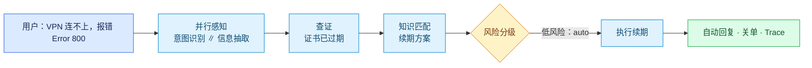
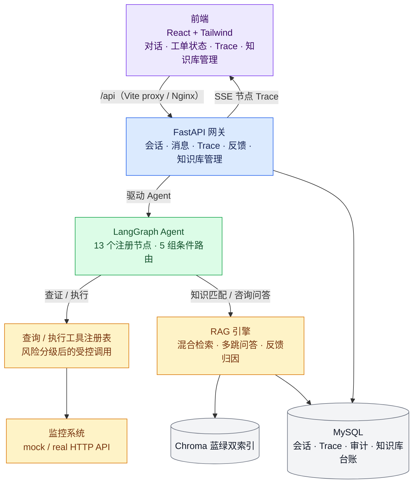
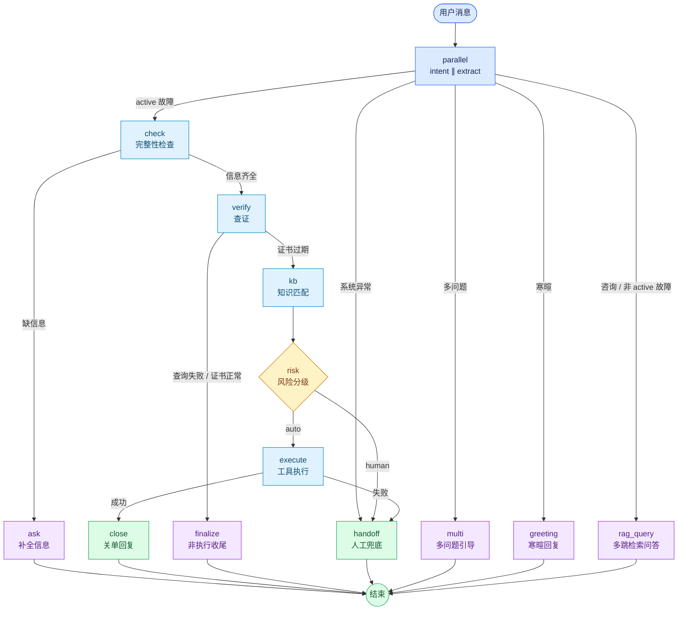
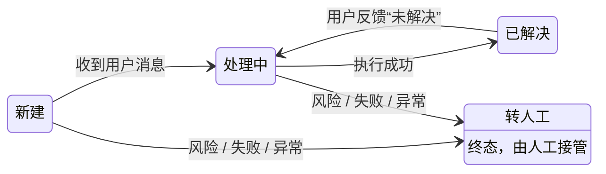
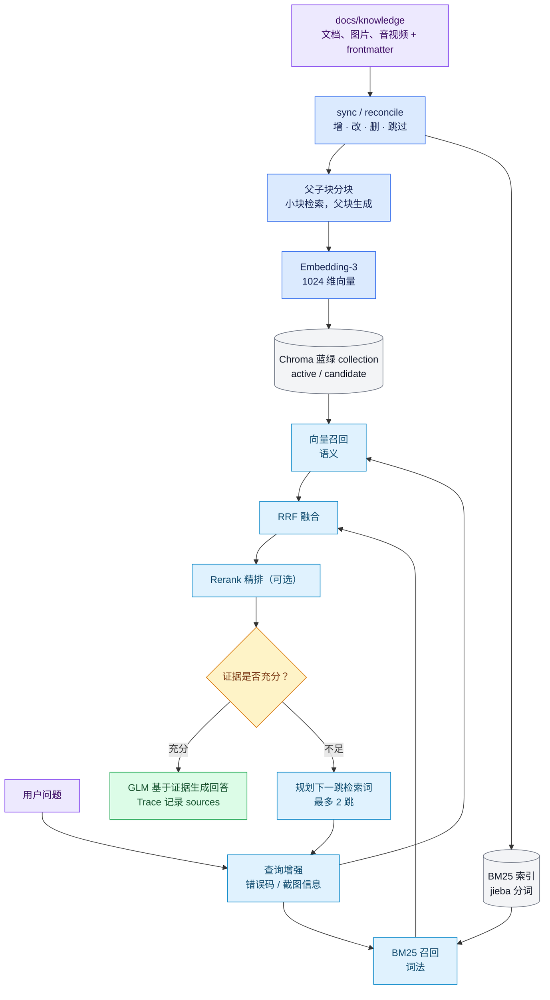

# 智能IT运维服务台（AI IT Helpdesk）

[](https://github.com/sleep-zzz520/AI-IT-Helpdesk/actions/workflows/ci.yml)

> 企业级 IT 运维服务台：用 **LangGraph 状态机** 编排 Agent，将 L1 重复工单（如 VPN 证书续期）从「45 分钟人工介入」压缩到「**2 分钟全自动闭环**」。

不是"能聊天的 Agent demo"，而是一套**可观测、可控、可评估、能上线**的 Agent 工程系统——风险分级执行 + 全链路 Trace + RAG 混合检索 + Eval 跑分 + 多租户安全 + CI/CD 测试工程化。

## 痛点与解法

**传统 L1 运维**困于"人肉中转"：接单 → 模板回复 → 反复追问 → 远程排查，一个简单故障耗时 45 分钟。

**本项目的 Agent 模式**（感知 → 决策 → 执行 全自动闭环）：



L1 工程师全程无感，仅在后台审计日志看到一条成功记录。

## 核心特性

- 🤖 **确定性 Agent 编排**：LangGraph 状态机（节点 + 条件边），流程显式、可观测、可断点
- ⚖️ **风险分级执行**：信任边界（低风险自动、高风险转人工，`RISK_POLICY` 配置）
- 🛠️ **MCP 风格工具链**：查询/执行工具按名字注册（`QUERY_REGISTRY` / `TOOL_REGISTRY`），可插拔；执行类工具是信任边界保护对象（只有过风险分级才允许）
- 📊 **全链路 Trace + 实时推送**：每节点语义化摘要（AI/规则/工具分类 + 状态色）+ 全链路耗时 + **SSE 边跑边推**（前端实时点亮，不"干等"）
- 🖼️ **视觉 OCR**：GLM-4V 从报错截图识别错误码（前端支持粘贴/上传）
- 📈 **Eval 自动化评估**：四份合成测试集真实跑分（意图 40 条 / 检索 60 条 / 问答 12 条 / 转译 15 张截图，报告落盘 tests/*.json）——指标明细、评估方法、**已知局限与失败分析**见「Eval 跑分」一节，不贴脱离方法的裸分数
- 🧩 **场景注册表（数据驱动）**：加新场景 = 填一张表，图代码零改动；启动校验防遗漏
- 🔎 **RAG 混合检索**：BM25（jieba 分词）+ 向量双路召回 → RRF 融合 → Rerank 精排（可选）
- 🧠 **Agentic 多跳检索**：retrieve → judge → 证据不足自动规划下一跳（MAX_HOPS=2，每跳记 Trace）
- 📄 **多模态知识入库**：pdf/docx/pptx/xlsx/图片/音视频 → GLM-4V/GLM-ASR 转译降维（8 类格式统一文本入库）
- 🔄 **蓝绿发布**：双索引交替，全量替换零中断 + 秒级回滚；影子测试对比新旧索引 Recall
- 👍 **反馈闭环**：用户 👍/👎 → 负反馈自动归类（文档缺失 vs 文档过时），反哺知识库运营
- 🏷️ **工单流转状态机**：新建 → 处理中 → 已解决/转人工，显式转移表 + 护栏（非法流转被挡）+ 流转历史留痕
- 🏢 **多租户 + 权限 + 审计**：PBKDF2 密码哈希 + HMAC token + 登录态注入身份（不信任前端传值）；跨租户数据隔离；登录/会话/反馈/知识库操作全审计
- 🔌 **真实监控 API 对接**：`MONITOR_MODE=mock|real` 双模式，real 走 HTTP（超时/重试/错误归一化），换真实系统只改 `MONITOR_BASE_URL`
- 🧪 **测试工程化**：pytest 一条命令跑全量离线回归（mock LLM + 内存 SQLite），CI 自动验证，改坏流程立刻红
- 📜 **统一日志系统**：logging 级别/文件轮转/结构化格式（时间|级别|模块|消息），容器日志卷持久化——生产排障可查，不再 print 满天飞
- 🧹 **代码规范强制**：后端 ruff + 前端 oxlint，CI 必跑，改坏规范立刻红
- 💾 **备份与恢复**：MySQL 全量备份（在线不锁表、保留 7 份滚动）+ 向量库打包 + 恢复演练脚本，数据可回滚

## 架构图



### Agent 执行状态图

下图对应 `backend/app/agents/graph.py`：**13 个注册节点**，以及 `parallel`、`check`、`verify`、`risk`、`execute` 五组条件路由。`intent` 与 `extract` 在 `parallel` 节点内部并行执行，因此会出现在 Trace 中，但不单独计为图注册节点。



### 工单生命周期状态图

这套状态机管理跨轮、可持久化的工单状态；它与上面的 LangGraph 单次执行图相互协作，但不是同一张图。



## RAG 知识库

### 架构：文档 → 分块 → 嵌入 → 双路检索 → 多跳问答



### 知识库生命周期管理

- **台账 = 事实账本**：`kb_documents` 表记录每篇文档的 hash/chunk 数/有效期/变更记录；列表、过期预警、ChangeLog 全查 MySQL，不碰向量库与源文件
- **reconcile 增量引擎**：内容 hash 变化才重建（幂等：连续两次 sync 第二次全跳过）；软删除（status=inactive）/ 物理删除（置 removed 留审计痕迹）/ 复活
- **蓝绿发布**：sync 全量写入候选索引（线上零中断）→ 影子测试对比新旧 Recall → 切指针秒级生效；回滚 = 再切一次（旧库未被覆盖前有效）
- **过期机制**：frontmatter `valid_to` 过期即不检索（检索过滤 `$gte` 今天）；管理页提前 30 天预警
- **反馈闭环**：用户 👍/👎 → 后台按该轮回答的 Trace（rag_query.sources）自动归类：无命中 → 文档缺失（补文档）；有命中 → 文档过时（修文档）

### 规模边界

| 规模 | 方案 | 说明 |
|---|---|---|
| 千级～十万级 chunk | ChromaDB（当前） | 单机毫秒级，持久化目录挂卷即可 |
| 百万级 chunk | Milvus | 只需改 `create_store()` 工厂函数（VectorStore 抽象层已隔离，检索/同步/切分代码零改动） |

多模态演进：当前用 GLM-4V/GLM-ASR **转译降维**（运维截图语义 95% 在文字，成本极低）；chunk 保留 `media_ref`（原始文件 + 页码），升级 bge-visualized-m3 / ColPali 联合嵌入时可直接路由原图。

## 快速启动

### 方式一：Docker 一键部署（推荐）

```bash
docker compose up -d --build
# 浏览器打开 http://localhost:8080
```

> 国内网络已内置镜像加速源；`ZHIPU_API_KEY` / `MYSQL_PASSWORD` 从项目根 `.env` 自动读取。

### 方式二：本地开发（前后端分离）

```bash
# 终端 1：后端（首次需先建表，uvicorn 启动会自动建）
cd backend
python3 -m venv .venv && source .venv/bin/activate   # 首次
pip install -r requirements.txt                       # 首次
uvicorn app.main:app --reload                         # http://127.0.0.1:8000

# 终端 2：前端（vite proxy 自动转发 /api 到后端）
cd frontend
npm install                                           # 首次
npm run dev                                           # http://localhost:5173
```

> 💡 **接口文档**：FastAPI 自带 Swagger UI——本地开发访问 http://127.0.0.1:8000/docs；Docker 部署访问 http://localhost:8080/docs（nginx 已反代）。可在浏览器直接调接口、看请求/响应结构。

### 演示路径

1. **登录**（多租户/权限体系）：用演示账号一键填充登录
   - `admin / Admin@2025`：管理员（可见知识库管理 + 审计日志）
   - `zhangsan / Zhangsan@2025`：普通用户（Acme 集团）
   - `lisi / Lisi@2025`：普通用户（Globex 科技）→ 与 zhangsan 数据隔离
2. 登录后自动开新会话（工单状态：新建），输入 `VPN连不上，报错Error 800，设备是Windows 11`（或截图后 Cmd+V 粘贴）→ 工单进入「处理中」
3. 右侧实时观察：**意图识别 → 查证 → 风险分级 → 执行续期 → 收尾关单** 的 Trace 链路 → 工单变「已解决」+ 工单号；工单卡片下方可见状态流转历史（新建→处理中→已解决）
4. 回复 `未解决` → 工单重新打开（处理中）——状态机闭环
5. 输入 `你好` / `我的密码忘了` → Agent 正确识别并转人工（不误触业务流）
6. 输入 `VPN证书怎么续期` → 走 **知识问答**（rag_query 多跳检索，Trace 显示依据来源）
7. **多租户隔离演示**：退出登录，用 lisi 登录 → 看不到 zhangsan 的会话（跨租户 404）
8. 用 admin 登录 → 顶栏「知识库管理」（台账/检索调试/同步/切换）+「审计日志」（谁在何时做了什么）

### 知识库同步（首次部署后执行一次）

```bash
cd backend && source ../.venv/bin/activate
python -m app.rag.sync                    # 全量写入候选索引
python -m scripts.test_shadow             # 影子测试：新旧索引 Recall 对比
curl -X POST http://localhost:8000/api/kb/switch   # 切换生效（零中断）
```

## Eval 跑分

四份**合成测试集**真实跑分（非模拟分数，报告落盘 `tests/*.json`，CI 可手动触发复跑）。

### 评估方法（不贴脱离方法的裸分数）

| 评估项 | 测试集规模 | 评估方式 | 指标 |
|---|---|---|---|
| 意图识别 | 40 条：标准说法基线 + 拼写错误（bpn→vpn）+ 口语（挂了/掉线）+ emoji/繁体 + 硬负例（WiFi/打印机/蓝屏）+ 多问题（vpn+密码）+ 纯寒暄 | 单节点评估（1 次 GLM/条，不走整图） | intent / request_type / multi 三维全对率 |
| RAG 检索 | 60 条查询 × 16 篇文档知识库：30 条语义表达、12 条错误码/命令等精确词、18 条近似干扰 | 离线构建临时库，双路对比 | Recall@1/3/5 + MRR（纯向量 vs 混合检索） |
| 回答质量 | 12 条咨询问题（含 3 条跨场景多跳候选） | RAGAS 风格：LLM-as-judge（GLM 免费做裁判） | faithfulness（拆声明→逐条判据）+ answer_relevancy（反推问题→向量相似度） |
| 转译质量 | 15 张合成截图：10 张干净图 + 5 张真实感退化图（模糊/低对比度/椒盐噪声/低分辨率） | GLM-4V 实际转译 | 错误码准确率（含防幻觉负例）/ 场景准确率 / 关键文字覆盖 |

### 当前跑分（检索项于 2026-09-09 重跑；其余项见各自报告）

```
=== 意图识别 Eval（40 条）===
三维全对 : 38/40 = 95.0%
intent 正确率 : 97.5%  request_type 正确率 : 97.5%  multi 引导正确率 : 100%

=== RAG 检索 Eval（60 条，16 篇文档）===
[vector_only] Recall@1=0.883 Recall@3=0.983 Recall@5=1.000 MRR=0.929
[hybrid]      Recall@1=0.917 Recall@3=1.000 Recall@5=1.000 MRR=0.956

=== 回答质量 Eval（12 条，GLM 做裁判）===
faithfulness=0.946 / answer_relevancy=0.825 / 多跳用例 1/12

=== 转译质量 Eval（15 张）===
错误码准确率 93.3% / 场景准确率 100% / 关键文字覆盖 100%
```

### 已知局限（为什么是这些数，以及它们说明了什么）

- **合成数据，非真实用户**：测试集为人工构造（符合 AGENTS.md"不伪造数据，用合成数据 + Eval 结果说话"原则），规模仍有限（40/60/12/15），不能外推到真实流量
- **LLM-as-judge 自评偏置**：faithfulness 是 GLM 判 GLM（裁判与作答同源模型，可能偏宽松）；answer_relevancy 的向量相似度阈值无标定
- **检索集仍有边界**：60 条题目来自当前 16 篇文档，并按语义、精确词和近似干扰分层；每条只有一个人工校对的期望文档，无法覆盖真实用户的多意图、错别字和答案本身不唯一的情况
- **混合检索的增益有限且可定位**：本轮混合检索比纯向量多命中 2 条 Top 1、1 条 Top 3，Recall@1 为 0.883→0.917、Recall@3 为 0.983→1.000，MRR 为 0.929→0.956；Recall@5 两者均为 1.000，无法区分排序质量
- **转译对模糊敏感**：错误码 93.3% 的失分来自 2px 高斯模糊图（错误码识别为空）——真实截图的分辨率/模糊是主要风险，场景分类与关键文字不受影响
- **边界用例有主观性**："vpn 能连上但是很慢"判 consult 还是 troubleshoot，期望值本身可争议（按系统哲学"宁多问不漏报障"修订为 troubleshoot）
- **硬件类问题可能误入软件域**："怎么安装打印机驱动"被 LLM 语义判为 software（驱动在语义上是软件）；software 场景当前为"开发中"状态，最终同样转人工，行为上殊途同归——但这是一个已知的意图边界
- **免费模型有波动**：同一用例两次运行可能判不同（如"邮箱收不到 IMAP 怎么配"的 request_type 在 consult/troubleshoot 间漂移）；eval 中限流/空响应触发 failover 重试（只影响耗时，不影响最终准确性）。以上分数为单次运行结果

### Eval 驱动改进闭环（测试集存在的意义）

1. **意图**：40 条扩集后暴露"怎么安装打印机驱动"被泛词"安装"拉进软件流 → 移除泛词 → 重跑验证
2. **检索**：噪声文档扩库后暴露 BM25 同文档霸榜 → RRF 文档级去重；随后把检索集扩至 60 条，当前混合检索 Recall@1/3 为 0.917/1.000，高于纯向量的 0.883/0.983
3. **多跳**：原 10 条用例 multihop=0（scenario=None 导致第 1 跳不过滤）→ 修正场景值后真实触发

### 复跑命令

```bash
cd backend && source ../.venv/bin/activate
python -m tests.eval            # 意图识别（40 条）
python -m tests.rag_eval        # 混合检索 Recall@k / MRR（60 条）
python -m tests.qa_eval         # 回答质量 faithfulness / answer_relevancy（12 条）
python -m tests.transcribe_eval # 多模态转译质量（15 张合成截图）
```

用例设计原则：正例变体（测泛化）+ 干扰项（测不误判）+ 噪声输入（拼写/口语/模糊图）+ 边界（灰色地带）+ 多问题；期望答案必须唯一可辩护。全部报告落盘 `tests/*.json`（含影子测试 `shadow_report.json`）。

## 运行测试

**一条命令跑全量离线回归**（不依赖真实 GLM、不连 MySQL）：

```bash
cd backend && source ../.venv/bin/activate
pip install -r requirements.txt   # 首次：含 pytest
pytest                            # 离线单测（mock LLM + 内存 SQLite + mock 监控）
```

- **离线单测**（`tests/test_*.py`，pytest）：Agent 故障执行链路（mock LLM + mock 监控）、咨询问答路径（mock 检索）、工单状态机（纯逻辑）、会话持久化（内存 SQLite）。conftest 在 import 前设 `MONITOR_MODE=mock` 等，回归零外部依赖。
- **前端单测**（Node 内置 `node:test`）：
  ```bash
  cd frontend && npm test
  ```
  覆盖 API 鉴权辅助函数、登录/401 行为、SSE 成功与错误事件、时长格式化；不依赖浏览器或新增测试框架。
- **真实 Eval**（`tests/*_eval.py`）：需要 `ZHIPU_API_KEY` + MySQL，验证模型真实能力，见上节（也可在 CI 手动触发 eval.yml）。
- CI 里后端 `pytest` 和前端 `npm test` 都是必跑步骤，任何 commit 都会自动验证，改坏流程立刻红。

## CI/CD（GitHub Actions）

**分层设计**：把「工程可信度」和「真实 Eval」分开，主流程不因外部依赖而红。

| 工作流 | 触发 | 依赖 | 跑什么 |
|---|---|---|---|
| [CI](.github/workflows/ci.yml) | push / PR | 零密钥、零数据库 | 后端语法检查 + **ruff lint** + import 冒烟 + **pytest 离线单测**（mock LLM + 内存 DB）；前端 `npm ci` → **npm test** → lint（oxlint）→ build |
| [Eval](.github/workflows/eval.yml) | 手动触发 | `ZHIPU_API_KEY` + MySQL | 四份 Eval（intent / rag / qa / transcribe）+ 报告上传 |

- **CI**：任何 commit 都自动验证「工程可信度」（改坏一个 import / 前端 build 挂了立刻红），不依赖真实模型，免费稳定。
- **Eval**：四份真实 Eval 依赖 GLM（免费但限流）+ MySQL，故走 `workflow_dispatch` 手动触发；需在仓库 `Settings → Secrets` 配置 `ZHIPU_API_KEY`。跑完上传四份 `*_report.json`，可用于复盘和 README 贴分。
- 为什么分开：真实 Eval 每次跑都要花钱/等限流，混进主流程会让 CI 频繁红，违背"每次提交都安心"的初衷。

## 备份与恢复

```bash
scripts/backup_mysql.sh    # MySQL 全量备份 → backups/mysql/，保留最近 7 份
scripts/backup_kb.sh       # 向量库 .rag/ 打包（台账在 MySQL，向量库可由文档重建）
scripts/restore_mysql.sh   # 恢复演练：清空重建 → 导入 → 校验表数
```

**备份链路设计**：MySQL 台账是事实来源（会话/工单/Trace/知识库台账/审计日志），向量库只是索引——所以 MySQL 备份是底线；向量库坏了直接用 `python -m app.rag.sync` 从 `docs/knowledge` 幂等重建，无需恢复。备份脚本用 `--single-transaction` 在线备份不锁表，保留 N 份滚动清理，`backups/` 已入 `.gitignore`。

## 设计决策

| 决策 | 为什么 |
|---|---|
| **LangGraph 而非 AutoGen** | 本项目是「可预期、可观测」的确定性流程（意图→追问→查证→执行），LangGraph 的节点+条件边=显式状态机，Trace 可视化、断点调试天然支持；AutoGen 偏多智能体对话编排，流程不可预期。手写循环则逻辑散落、难维护 |
| **场景注册表（数据驱动）** | 加场景 = 填一张表（信息清单/意图规则/查证工具/话术），图代码零改动；启动校验防配置遗漏 |
| **风险分级 = 信任边界** | 企业让 AI 落地的第一问是"它凭什么能自己动手"。`RISK_POLICY` 划清"能自动的/要人点头的"，未知风险默认 high（安全优先） |
| **mock 先行** | 查询/执行工具先 mock（返回格式即真实 API 契约），换真实实现只改 tools/ 一个文件，节点代码零改动 |
| **openai SDK 调智谱** | 模型无关：换 DeepSeek/OpenAI 只改 `.env` 的 base_url 和 model |
| **视觉模型做 OCR** | UI 截图的错误码藏在弹窗里，视觉模型"看图理解"优于传统 OCR"认字符"，且零系统依赖 |
| **同源代理** | 前端永远用相对路径 `/api`：开发 vite proxy、生产 nginx 反代，一套代码无 CORS |
| **台账 + 向量库分离** | 知识库生命周期（变更检测/过期/审计）全走 MySQL 台账，向量库只是索引——读台账毫秒级，且不怕 Chroma 重建 |
| **蓝绿双索引发布** | 同步永远写候选索引（线上零中断），影子测试验证后切指针（秒级生效/回滚）；"切换"只是改一个落盘文件，无数据搬迁 |
| **转译降维而非联合嵌入** | 运维截图语义 95% 在文字：GLM-4V/GLM-ASR 转成文本入库（免费/毫秒级），保留 media_ref 兼容未来 ColPali |
| **多模型故障转移（failover）** | 模型链按优先级排列 + 游标记忆 + 429/5xx 短拉黑 + 403/404 账号级拉黑——免费模型限流时自动切换下一个，不再白等退避 |
| **SSE 流式推送执行链路** | 用户从"干等回复"变"实时看 Agent 每步在干嘛"；边跑边落库防断连丢数据（nginx 关缓冲解决 2s 缓冲踩坑） |
| **登录态注入身份（不信任前端）** | 多租户隔离靠登录态（token → user_id → tenant_id），前端传值一律不采纳——跨租户访问直接 404 |
| **测试工程化（mock LLM + 内存 DB）** | 回归零真实 GLM、零 MySQL：conftest 在 import 前锁环境变量 + patch 5 个 LLM 调用点 + SQLite 内存库——CI 稳定免费不依赖外部 |
| **台账备份为底线、向量库可重建** | MySQL 是事实来源、向量库只是索引，所以备份 MySQL 优先；向量库坏了 `sync` 幂等重建，降低备份复杂度 |

## 目录结构

```
├── backend/
│   ├── app/
│   │   ├── agents/       # LangGraph 状态机（scenarios 注册表 + nodes/）
│   │   ├── tools/        # MCP 风格工具（查询/执行注册表 + OCR + 知识库）
│   │   ├── rag/          # RAG 子系统（loader/splitter/embedder/store/bm25/
│   │   │                 #   reranker/retriever/sync/transcribe/asr/video）
│   │   ├── api/          # FastAPI 路由（conversations / kb 管理 / feedback）
│   │   ├── services/     # 会话持久化（存取 state）
│   │   ├── logging_config.py  # 统一日志（级别/文件轮转/结构化）
│   │   └── models.py     # ORM（conversations/messages/traces/kb_documents）
│   ├── scripts/          # 验证脚本（e2e/sync 闭环/影子测试/OCR/转译…）
│   ├── tests/            # pytest 离线单测（test_*.py）+ Eval 测试集与评估器
│   ├── conftest.py       # pytest 全局配置（mock LLM + 内存 DB + 隔离 KB）
│   ├── pyproject.toml    # ruff 配置（后端代码规范）
│   └── pytest.ini        # pytest 配置（pythonpath/testpaths/markers）
├── frontend/             # React + Tailwind（对话/工单/Trace/知识库管理）
├── docs/knowledge/       # 知识文档源（唯一事实来源，sync 扫描它）
├── scripts/              # 环境安装 / 备份恢复（backup_mysql / backup_kb / restore_mysql）
└── docker-compose.yml    # 一键部署
```

## 技术栈

| 层 | 选型 |
|---|---|
| Agent 编排 | LangGraph（状态机，非 AutoGen——见设计决策）|
| 模型 | GLM-4.7-Flash（免费，多模型 failover）/ GLM-4V-Flash（OCR）/ Embedding-3（0.5 元/百万 tokens）|
| 向量库 | ChromaDB（VectorStore 抽象，预留 Milvus）|
| API | FastAPI |
| 存储 | MySQL 8 + SQLAlchemy 2.0 |
| 检索 | BM25（jieba + rank_bm25）⊕ 向量 → RRF 融合 → 智谱 Rerank（可选）|
| 前端 | React + Vite + Tailwind v4 + Phosphor（对话/工单/Trace/知识库管理）|
| 测试 | pytest（mock LLM + 内存 SQLite，离线回归）+ 四份真实 Eval |
| 代码规范 | ruff（后端，替代 black/isort 一体）+ oxlint（前端）|
| CI/CD | GitHub Actions（主 CI 零密钥自动验证 + Eval 手动触发）|
| 部署 | Docker Compose（nginx 反代 + mock_monitor 监控服务）|
